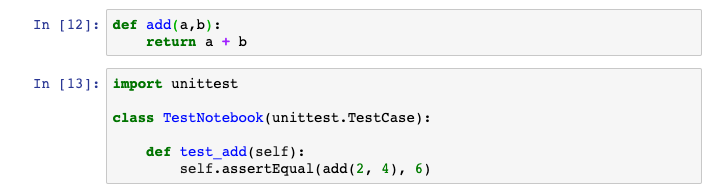
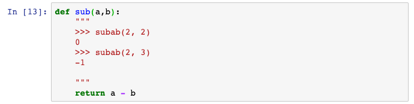

# treon

[](https://badge.fury.io/py/treon)
[](https://travis-ci.org/ReviewNB/treon)

Easy to use test framework for Jupyter Notebooks.
* Runs notebook top to bottom and flags execution errors if any
* Runs [unittest](https://docs.python.org/2/library/unittest.html) present in your notebook code cells
* Runs [doctest](https://docs.python.org/2/library/doctest.html) present in your notebook code cells

### Why should you use it?
* Start testing notebooks without writing a single line of test code
* Multithreaded execution for quickly testing a set of notebooks
* Executes every Notebook in a fresh kernel to avoid hidden state problems
* Primarily a command line tool that can be used easily in any Continuous Integration (CI) system


## Installation
```
pip install treon
```

## Usage
```
$ treon
Executing treon version 0.1.0
Recursively scanning /workspace/treon/tmp/docs/site/ru/guide for Notebooks...

-----------------------------------------------------------------------
Collected following Notebooks for testing
-----------------------------------------------------------------------
/workspace/treon/tmp/docs/site/ru/guide/keras.ipynb
/workspace/treon/tmp/docs/site/ru/guide/eager.ipynb
-----------------------------------------------------------------------

Triggered test for /workspace/treon/tmp/docs/site/ru/guide/keras.ipynb
Triggered test for /workspace/treon/tmp/docs/site/ru/guide/eager.ipynb

test_sum (__main__.TestNotebook) ...
ok
test_sum (__main__.TestNotebook2) ...
ok
test_sum (__main__.TestNotebook3) ...
ok

----------------------------------------------------------------------
Ran 3 tests in 0.004s

OK

-----------------------------------------------------------------------
TEST RESULT
-----------------------------------------------------------------------
/workspace/treon/tmp/docs/site/ru/guide/keras.ipynb       -- PASSED
/workspace/treon/tmp/docs/site/ru/guide/eager.ipynb       -- PASSED
-----------------------------------------------------------------------
2 succeeded, 0 failed, out of 2 notebooks tested.
-----------------------------------------------------------------------
```

## Command line arguments
```
Usage:
  treon
  treon [PATH] [--threads=<number>] [-v] [--exclude=<string>]...

Arguments:
  PATH                File or directory path to find notebooks to test. Searches recursively for directory paths. [default: current working directory]

Options:
  --threads=<number>  Number of parallel threads. Each thread processes one notebook file at a time. [default: 10]
  -e=<string> --exclude=<string>  Option for excluding files or entire directories from testing. All files whose
                      absolute path starts with the specified string are excluded from testing. This option can be
                      specified more than once to exclude multiple files or directories. If the exclude path is
                      a valid directory name, only this directory is excluded.
  -v --verbose        Print detailed output for debugging.
  -h --help           Show this screen.
  --version           Show version.
```

## unittest example
You just need to add tests as shown below & treon would execute them and report the result on the console. See [this](https://docs.python.org/2/library/unittest.html) for more details on how to write unittest.



## doctest example
You just need to add tests as shown below & treon would execute them and report the result on the console. See [this](https://docs.python.org/2/library/doctest.html) for more details on how to write doctest.



## Note about dependencies
* You need to run treon from environment (virtualenv/pipenv etc.) that has all the dependencies required for Notebooks under test
* treon only works with python3+ environments and uses python3 kernel for executing notebooks

## Development
For development, you may use below to create a Python interpreter that resides in `venv` in the current working directory, and to install all of treon's dependencies:

```
$ virtualenv venv
$ source venv/bin/activate
$ pip install -e .
$ pip install -r requirements-dev.txt
$ treon --help # should work
```

Because the script installs the package as editable, you can make changes in the source tree and use the `treon` command to immediately validate them. If this does not appear to work, check that you are using a the proper virtual environment, and that the package is indeed installed in editable mode:

```
$ which treon # should point into your virtualenv
/path/to/my/venv/bin/treon
$ pip list --local | grep treon # should point to the source tree
treon                0.1.3                /workspace/treon
```

Please refer to the `Makefile` for supplementary development tasks.
In particular, the following targets may be relevant when validating changes before committing:

```
$ make lint # check treon's source for code style errors
$ make test # run all tests
```

## Motivation
Our aim at [ReviewNB](https://www.reviewnb.com/) is to make notebooks a first class entity in the production workflow. We've built a code review system for Notebooks. The next step is to [build a CI pipeline](https://github.com/ReviewNB/support/issues/19) & treon is the core tool in that effort. It is licensed liberally (MIT) & I foresee it being used as an independent tool as well. You can use it locally and/or integrate with CI system of your choice.

For motivation, checkout [Netflix's blog](https://medium.com/netflix-techblog/scheduling-notebooks-348e6c14cfd6) to see how notebooks are graduating from scratchpad to a part of production workflow.

## Contribute
If you see any problem, open an issue or send a pull request. You can write to team@reviewnb.com for any questions.
